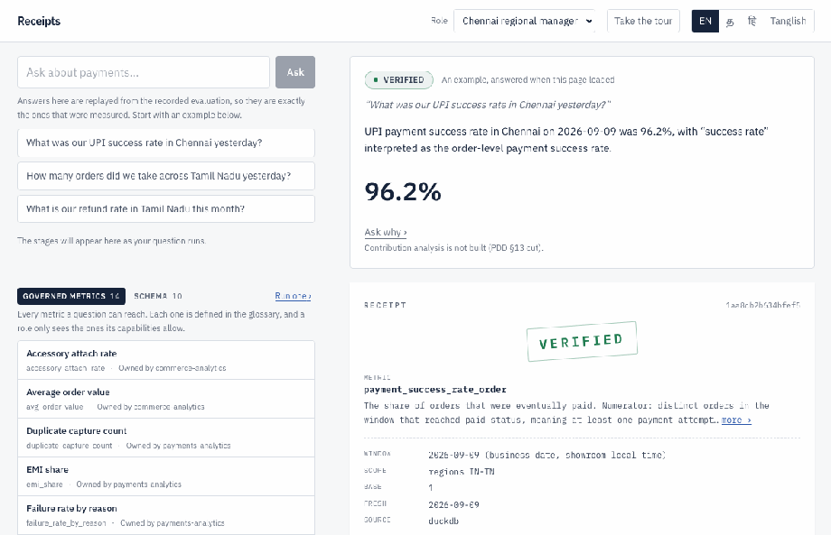
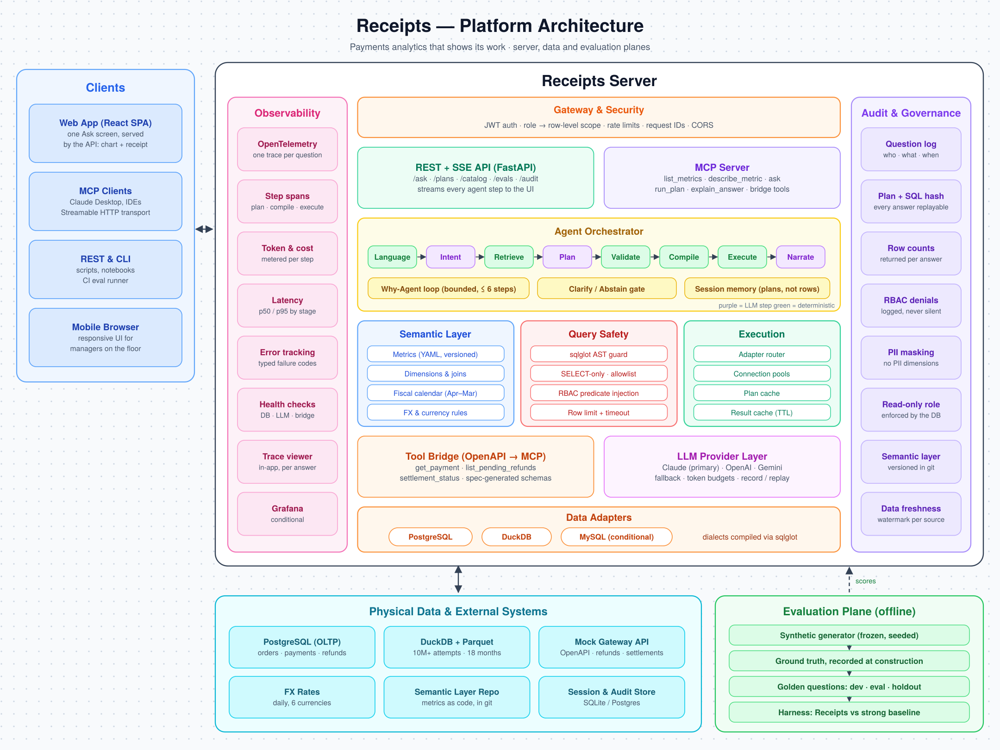
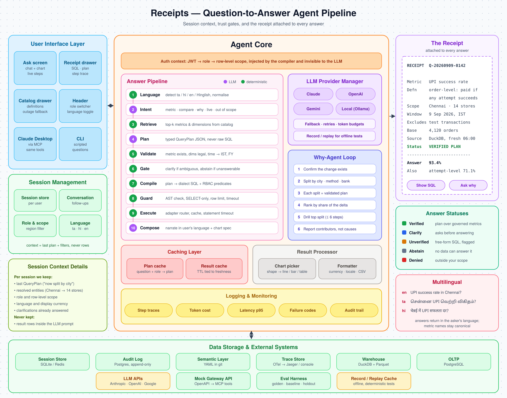

# Receipts

**Two theses. One failed, one held.** On 91 held-out questions the pre-declared
accuracy test — Receipts' silent-wrong rate at most half the baseline's
(T2 ≤ 0.5) — came out at **0.733**, and conditional on answering Receipts was
**worse than the baseline**: 36.7% silently wrong against 33.3%. The accuracy
thesis failed. The authorisation thesis held: on the six questions that ask for
data outside the asker's region, Receipts refused **5 of 6** and the baseline
**0 of 6**.

**In one sentence.** A payments-analytics agent that will not let a language
model write SQL or choose who may see what — the model proposes a typed plan, a
deterministic compiler welds the asker's scope into the query, and every answer
carries a receipt naming the metric, the window, the scope and the hashes; the
measurement says that buys authorisation, and does not buy accuracy.



*Twenty seconds, no sound: a Chennai manager asks in Tamil, the stages run, the
answer arrives with its receipt — then the same manager asks about Dubai and is
refused, with no receipt because nothing ran.*

In the project's own pre-written words, chosen before any result was seen
(PDD §12):

> *A strong baseline given the same metric definitions was about as safe as the
> constrained pipeline. The definitions did the work, not the architecture. The
> remaining case for Receipts is governance (scoping, audit, receipts) rather
> than accuracy, and we report it on those terms.*

| holdout, English, 91 trials | Receipts | baseline |
|---|---:|---:|
| coverage (ANS correct) | 14/45 = **31.1%** | 29/45 = 64.4% |
| silent-wrong, raw | 11/45 = **24.4%** | 15/45 = 33.3% |
| silent-wrong given it answered | 11/30 = **36.7%** | 15/45 = 33.3% |
| declined to answer | 15/45 = 33.3% | 0/45 |

Receipts' lower raw rate comes entirely from declining a third of the questions.
Four pre-declared thresholds failed: T1 (silent-wrong ≤ 3%), T2 (≤ 0.5),
T3 (accuracy ≥ 85%), T5 (over-abstention ≤ 10%).

Every number above is in
[`eval/results/holdout/`](eval/results/holdout/), written by one run at commit
`dd5227a`, on `openai/gpt-5.5-2026-04-23`. The holdout ran **once**; a second run
of either arm is refused by `eval/results/holdout/LOCK` (D17, ADR-023).

## What did survive

**Scope.** On the six questions that ask for data outside the asker's region,
Receipts refused **5 of 6** correctly. The baseline got **0 of 6**.

The difference is structural. Receipts' scope is a predicate the compiler welds
into the SQL from the role, after the plan exists — the model is never told which
regions the asker may see and cannot put a scope in a plan, because `QueryPlan`
has no scope field. The baseline's scope is a paragraph of English in a prompt.
One is enforced; the other is requested.

That is the governance claim, and it is the one the measurement supports.

## One question, end to end

The Chennai regional manager asks, in Tamil:

> நேற்று சென்னையில் நமது UPI success rate எவ்வளவு?
> *(What was our UPI success rate in Chennai yesterday?)*

The answer comes back in Tamil, saying which metric it decided the question
meant:

> நேற்று (2026-09-09) சென்னையில் UPI-க்கான payment success rate 96.2%; இங்கு
> "success rate" என்பது order-level payment success rate ஆக எடுத்துக்
> கொள்ளப்பட்டது.

And the receipt underneath it:

```
STATUS    VERIFIED                     receipt 679a9c5ad7dfa3ca
METRIC    payment_success_rate_order
          The share of orders that were eventually paid. Numerator: distinct
          orders in the window that reached paid status, meaning at least one
          payment attempt was captured.
WINDOW    2026-09-09 (business date, showroom local time)
SCOPE     regions IN-TN
BASE      1          FRESH  2026-09-09          SOURCE  duckdb
EXCLUDES  test orders, test attempts
DEFAULTS  metric choice settled by the glossary:
            'success rate' -> Payment success rate (order-level)
          payment_method 'UPI' → 'upi'
          reporting currency → INR (the rm_tamil_nadu default)
          payment_success_rate_order chosen;
            siblings not asked for: payment_success_rate_attempt
PLAN      0a1d6752fb7ad6a5…            SQL  eca7d3a9131014ed…
```

Four of those lines are the ones an analyst would otherwise have to ask about.
"Success rate" is ambiguous in payments — per order or per attempt? — and the
receipt says which one it chose, names the one it did not, and points at the
glossary entry that settled it. `SCOPE regions IN-TN` was not requested by the
question or chosen by the model; it was welded in by the compiler from the
asker's role.




## The finding that matters most

**The gap between dev and holdout is the size of the memory dev carries.**

On dev, Receipts scored 71.3% coverage and 11.1% silent-wrong. On the holdout,
31.1% and 24.4%. Dev is the set six diagnostic rounds ran against. Every fix in
those rounds implemented a rule written down *before* the failure was seen — the
glossary, the SDD — and each was verified against hand-written reference SQL
rather than against the scorer. None of that was cheating, and it still did not
transfer.

A development set that has been looked at six times is not a measurement. It is
a memory of six rounds of looking, and the only way to find out how much of the
number was memory was to spend it on questions nobody had seen.

## What this project is

A payments-analytics agent for a fictional phone retailer. Questions arrive in
English, Tamil, Hindi or Tanglish; a model produces a typed `QueryPlan` over a
governed semantic layer; a deterministic compiler writes the SQL; **every answer
carries a receipt** naming the metric, its definition, the window, the scope,
what was excluded, and the hashes of the plan and the SQL.

The model never writes SQL on the verified path. When it does — the free-form
fallback — the answer returns `UNVERIFIED` and says so.

**What a receipt cannot do.** It attests to *how* an answer was computed. It
cannot attest that the rows came back. This demo shipped with a single DuckDB
connection serving every request, and a connection holds one pending result — so
under concurrent load one request's query replaced another's before it was
fetched, and the first got nothing. That empty result travelled the whole
governed path and came out as an answer saying there were no units sold, over a
question whose true answer is 1107 units at one showroom. Status: VERIFIED.
Receipt: complete, correct, and truthful about a query that had genuinely
returned nothing. The grounding check passed too, because it asserts that every
number in the narration appears in the result table — and the narration had no
numbers.

It shipped in M17 and was found in M21.7, by two runs of a screenshot spec
differing in 41% of their pixels. Every test in the suite asked one question at a time,
which is the one condition under which it cannot happen. It is fixed, and it is
here rather than only in the notes because the failure is the argument's own
shape: **a receipt raises the floor on what a wrong answer can hide, and it is
not the same thing as the answer being right.**



### The measurement machinery

The point of the machinery is that a result like the one above can be trusted to
be the result.

- **Thresholds were pre-declared** in `config/thresholds.yaml` at G0, before any
  engine code existed, and are frozen.
- **Two systems, one harness.** The baseline (B0) gets the same questions, the
  same metric definitions and the same model. It is not a straw man: it beat
  Receipts on coverage.
- **Answers are compared against hand-written reference SQL**, not against the
  scorer's opinion.
- **Every model call is recorded and replayed.** Two consecutive replays of a run
  produce byte-identical reports (D16), so a published number can be reproduced
  from the repository.
- **The holdout runs once**, behind a lock recording the system, the language set
  and the commit.
- **No clock reads in engine packages** (D2), deterministic IDs only (D3), money
  as integer minor units (D1) — each enforced by a charter test that walks the
  AST rather than grepping.

1,288 tests. `LIMITATIONS.md` is the list of everything this project cannot
claim, including the three errors I made in the round that produced the result above.

### Cost

Measured over the same 30 questions through the same meter
([`eval/results/bench.json`](eval/results/bench.json)):
**Receipts $36.20 per 1,000 questions, baseline $99.28** — the baseline puts the
whole schema in the prompt (16,160 median input tokens against 3,625).

## Why this matters for payments

**This is a prototype architecture, not a production system, and nothing here is
production-ready.** It runs on a synthetic warehouse for a fictional retailer,
it has been measured once on 91 questions, and the accuracy thesis it was built
to prove did not hold. What follows is what the shape is *for*, not a claim that
it works at scale.

Payments analytics has a property that makes natural-language querying harder
than it looks: **the words are ambiguous in ways that change the number by a lot,
and the ambiguity is invisible in the answer.** "Success rate" is per order or
per attempt. "Revenue" is captured, settled, or net of refunds. "Yesterday" is a
business date in the showroom's local time or a UTC timestamp. A system that
picks one and reports a number has not answered the question; it has answered
one of several questions and not said which. That is the failure this project
calls *silently wrong*, and on the holdout both systems did it about a third of
the time they answered.

Three parts of the shape are worth keeping regardless of that result:

- **Definitions live in a governed layer, not in a prompt.** Each metric has an
  owner, a written definition, the dimensions it may be cut by, and what it
  excludes. The receipt quotes the definition that was used, so a disagreement
  about a number becomes a disagreement about a definition — which is a
  conversation a team can actually have.
- **Authorisation is compiled, not requested.** Scope is a predicate the compiler
  welds into the SQL from the caller's role after the plan exists. The model is
  never told which regions the asker may see and could not act on it if it were:
  `QueryPlan` has no scope field. This is the part the measurement supports, and
  in a domain where the rows are customers' payments it is the part that would
  stop a demo becoming an incident.
- **Refusal is a first-class answer.** Out of scope, ambiguous beyond the
  glossary's ability to settle, or not computable from the layer — each returns
  a typed refusal that says which, rather than a plausible number. Receipts
  declined a third of the holdout, which cost it coverage and is the honest
  trade it was built to make.

What the measurement says about all this is narrow and worth stating plainly:
the governed layer did not make the answers more accurate than a strong prompted
baseline with the same definitions. It made the *authorisation* hold, and it
made every answer auditable after the fact. Whether that trade is worth its cost
depends on what a wrong answer costs you, which is a question about your
business and not about this repository.

## Try it

**Live demo:** https://13-232-84-149.sslip.io/?role=rm_tamil_nadu

Answers are replayed from the recorded evaluation, so they are exactly the ones
that were measured. Switch role in the header and ask the Chennai manager about
Dubai. First visit runs a short guided tour.

The certificate is a real Let's Encrypt one. There is no domain: `sslip.io`
resolves `13-232-84-149.sslip.io` to `13.232.84.149`, so the Elastic IP is the
hostname, and Caddy on the same box gets and renews the certificate.

Needs Python 3.11 (the package pins `>=3.11,<3.12`) and Docker for `make up`.

```bash
make setup    # .venv on python3.11, the package, the commit-msg hook
. .venv/bin/activate
make data     # generate the synthetic warehouse (~3.5 min)
make up       # API, SPA and MCP in one container, at :8000
make eval     # re-run a scored evaluation and diff it against the committed one
```

To run the suite, two artifacts have to exist first, because the tests that need
them fail rather than skip (SDD §773): `make web` builds the SPA, and `make
up-db` starts the Postgres that `test_adapters_agree` compares DuckDB against.
Then `make test` — 1,288 tests, no skips.

`make data` needs `KESTREL_SEALED_SEED`, which plants the anomalies the blind
holdout is graded against. It is not in the repo and will not be: a published
seed is a published answer key (PDD §5). Without one the target builds from a
demo seed and says so. That warehouse runs the suite, the demo and `make bench`;
it is not the graded one, so its `data_version` differs from
`docs/FREEZE_MANIFEST.json` and its sealed plants are not the ones behind the
holdout numbers above. Those numbers are reproducible from the committed
artifacts, not from a regenerated warehouse — which is what a sealed holdout
costs. Five tests assert the graded warehouse and so fail against a demo one;
the suite names them at the end of the run, and any other failure is a real one.

`make bench` reports latency per stage and cost per 1,000 questions.
`make web-e2e` runs the browser journeys.

The MCP server is mounted inside the API at `/mcp`; setup for Claude Desktop is
in [`docs/MCP.md`](docs/MCP.md). The token decides what you can see and nothing
else does — scope is recomputed from `config/roles.yaml` on every call.

### If the demo is down

**The hosted demo may be taken down after the review window.** It is a t3.small
in ap-south-1 that costs real money to leave running, and the address is
released with it — so if the link above does not answer, it has been torn down
rather than broken.

The local instructions above are the permanent fallback and are not going
anywhere: `make setup && make data && make up` gives you the same application on
`localhost:8000`, replaying the same recorded answers. Nothing about the demo is
hosted-only.

For the record, the two commands that run and remove it:

```bash
deploy/aws/lambda.sh          # build the image at HEAD and push it to ECR
deploy/aws/ec2.sh             # launch, attach the Elastic IP, get the cert
deploy/aws/ec2.sh --teardown  # terminate, release the address, delete the role
```

`--teardown` releases the Elastic IP as well as terminating the instance, which
matters: an unattached Elastic IP is billed hourly, so the one state to never
leave behind is an address holding nothing. A redeploy is `ec2.sh` again — it
replaces the instance and keeps the address, so the URL survives.

All data is synthetic. Kestrel Mobile is fictional.
